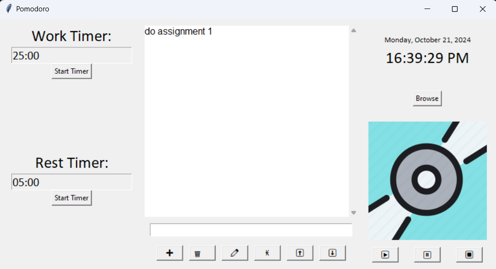

# Pomodoro Timer and To-Do List with Audio Player

This is a Pomodoro Timer application developed using Tkinter, designed to help users manage tasks and improve focus by following the Pomodoro technique. The app also includes a to-do list for task tracking, as well as an integrated audio player with a rotating disc animation, perfect for playing background music while working.

## Overview of the Pomodoro Technique
The Pomodoro technique is a time management method that encourages productivity through focused work sessions and regular breaks. Typically, users work for 25 minutes (a "Pomodoro") and then take a 5-minute break. After four Pomodoros, a longer break is recommended.

This app aims to facilitate that technique by providing both a work timer and a break timer, while also offering task tracking and music playback features.

## Features
### 1. Pomodoro Timer
Work Timer: Set for 25 minutes by default, helping you focus on work without distractions.
Break Timer: A short 5-minute break to rest between work intervals.
Alarm Sound: Plays a sound when the timer hits 00:00, indicating the end of a work or break session.

### 2. To-Do List
Task Management: Add, delete, and edit tasks to keep track of your to-dos.
Strike Through Feature: Tasks can be marked as completed by striking through them instead of deleting.
Task Movement: Move tasks up or down the list for prioritization.
Persistent Storage: All tasks are saved in an SQLite database, ensuring that your list is retained even after the application is closed and reopened.

### 3. Audio Player
Play, Pause, and Stop: Control the playback of background music directly within the app.
Music Selection: Choose your own audio files to play (supports .mp3 and .wav formats).
Rotating Disc Animation: A visually appealing rotating disc animation plays while music is running.
Browse for Audio: Easily select audio files from your local storage through a file dialog interface.

### 4. Task Persistence
SQLite Database: Tasks are saved in a local SQLite database (tasks.db). This ensures that tasks persist between sessions, allowing you to resume where you left off.

### 5. Current Date and Time Display
A live display of the current time and date is included, helping you stay aware of the time while managing tasks.

### 6. Interactive Interface
The user interface is built with Tkinter, providing a simple and user-friendly environment for managing tasks and timers.

## Application Components
### 1. Pomodoro Timer
The timer alternates between the work session (25 minutes) and the break session (5 minutes). The timer's progress is updated every second, and the user can start, stop, or reset the timer with ease.

### 2. To-Do List
Task Addition: Users can add tasks through an entry field.
Task Deletion: Selected tasks can be removed from the list.
Task Editing: Tasks can be modified directly within the app.
Task Strike-Off: Completed tasks can be marked by striking through text.
Task Movement: Users can move tasks up or down the list to adjust priorities.

### 3. Audio Player
Select an audio file for background music using the Browse button.
Play, pause, and stop the music directly from the app.
A rotating disc animation is displayed while music is playing.

## How to Run the Application
1. Prerequisites:
* Make sure you have Python installed (version 3.7 or higher).
* You will need the following libraries:
    * Tkinter
    * SQLite3
    * pygame (for audio playback)
    * Pillow (for image handling)
* To install required packages, run the following command: pip install pygame Pillow

2. Running the Application:
* Download or clone the repository.
* Open a terminal or command prompt, navigate to the project folder, and run the following command: python main.py
* The Pomodoro Timer application will launch with all its features.

## Additional Notes
* Customization: You can customize the work and break durations by modifying the default timer settings in the code.
* Persistent Tasks: Tasks saved in the to-do list will automatically reload from the database upon reopening the application.
* Audio Controls: The application supports the playback of .mp3 and .wav audio formats, which can be selected using the file browser.

## Future Enhancements
Potential future improvements include:
* Customizable Timer Length: Allow users to set their own work and break intervals.
* Multiple Timers: Add options for different Pomodoro cycles (e.g., long breaks).
* Task Categories: Support for organizing tasks into categories or adding deadlines.

